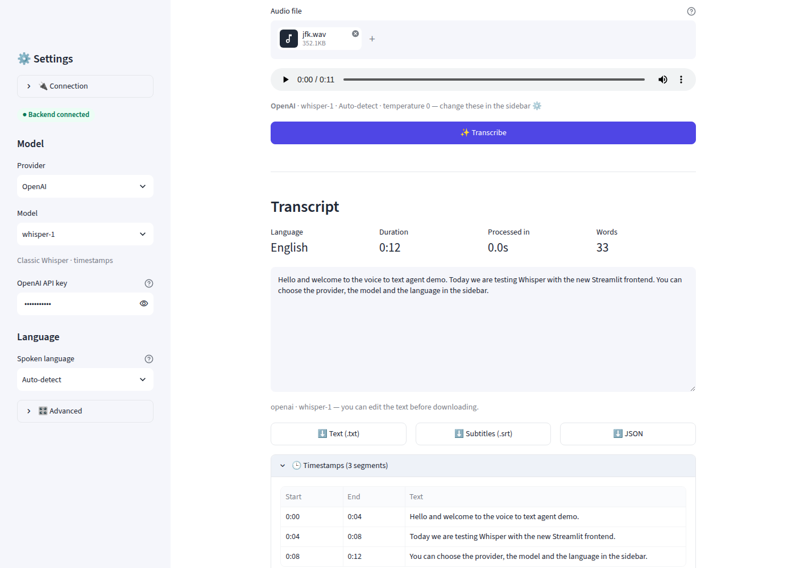
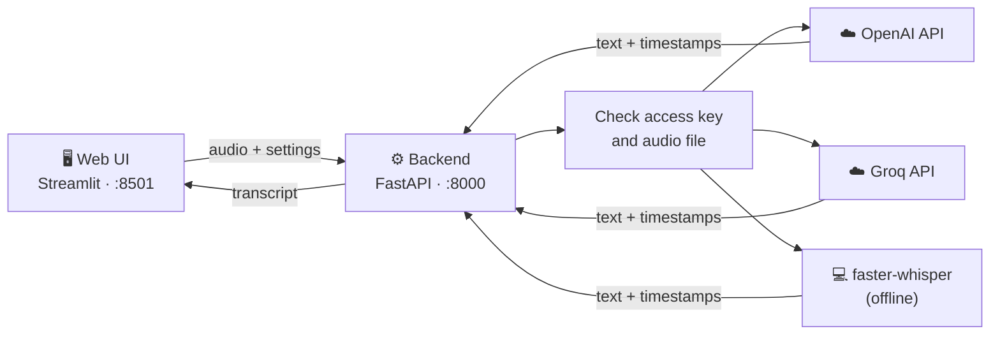

# 🎙️ VoiceAgent: Voice to Text

Record or upload audio in your browser and get an accurate transcript in seconds.
Choose the **provider**, **model** and **language**, tune the parameters, then download the result as text,
subtitles or JSON.



- **3 providers:** OpenAI, Groq, or a free offline Whisper model on your own computer
- **Pick your model:** `whisper-1`, `gpt-4o-transcribe`, `whisper-large-v3-turbo`, `tiny` … `large-v3`
- **Bring your own API key:** paste it in the app, nothing is stored
- **21 languages** or auto-detect, plus temperature, beam size and a vocabulary hint
- **Export:** `.txt`, `.srt` subtitles with timestamps, or `.json`

---

## 🚀 Quick start

You need **Python 3.11+** ([download](https://www.python.org/downloads/)) and **Git**.
The app has two parts that run side by side: the **backend** (does the transcription) and the **web UI**.
You'll use **two terminal windows**.

### 1. Download and install (once)

**macOS / Linux**

```bash
git clone https://github.com/GVanave/VoiceAgent.git
cd VoiceAgent
python3 -m venv .venv
source .venv/bin/activate
pip install -r requirements.txt -r frontend/requirements.txt
cp .env.example .env
```

**Windows (PowerShell)**

```powershell
git clone https://github.com/GVanave/VoiceAgent.git
cd VoiceAgent
py -m venv .venv
.venv\Scripts\Activate.ps1
pip install -r requirements.txt -r frontend/requirements.txt
copy .env.example .env
```

> If PowerShell refuses to run `Activate.ps1`, run `Set-ExecutionPolicy -Scope CurrentUser RemoteSigned` once.

### 2. Start the backend (terminal 1)

```bash
uvicorn app.main:app --reload
```

Leave it running. You should see `Uvicorn running on http://127.0.0.1:8000`.

### 3. Start the web UI (terminal 2)

Open a second terminal in the `VoiceAgent` folder, activate the environment again
(`source .venv/bin/activate`, or `.venv\Scripts\Activate.ps1` on Windows), then:

```bash
cd frontend
streamlit run app.py
```

Your browser opens **http://localhost:8501** automatically. 🎉

### 4. Transcribe

1. In the sidebar, choose a **Provider** and **Model**, and paste your **API key**
   ([OpenAI key](https://platform.openai.com/api-keys) · [Groq key](https://console.groq.com/keys), Groq has a free tier).
2. Pick the **Spoken language**, or leave *Auto-detect*.
3. Click **🎤 Record** and speak, or **📁 Upload** an audio file.
4. Click **✨ Transcribe**. Edit the text if you like, then download it.

**Next time**, you only need steps 2 and 3: activate the environment and start both parts.

---

## 🐳 Alternative: start with Docker (one command)

If you have [Docker Desktop](https://www.docker.com/products/docker-desktop/), you don't need Python:

```bash
git clone https://github.com/GVanave/VoiceAgent.git
cd VoiceAgent
cp .env.example .env          # Windows: copy .env.example .env
docker compose up --build
```

Then open **http://localhost:8501**. Stop it with `Ctrl+C`.

---

## 🧠 Providers and models

| Provider | Models | Cost | Notes |
|---|---|---|---|
| **OpenAI** | `whisper-1`, `gpt-4o-transcribe`, `gpt-4o-mini-transcribe` | Paid, per minute | `gpt-4o-*` are the most accurate but return no timestamps |
| **Groq** | `whisper-large-v3-turbo`, `whisper-large-v3` | Free tier available | Very fast, with timestamps |
| **Local (offline)** | `tiny`, `base`, `small`, `medium`, `large-v3` | Free | Runs on your computer, audio never leaves it |

### Using the free offline engine

```bash
pip install -r requirements-local.txt
```

Restart the backend, choose **Local (offline)** in the sidebar, and start with the `base` model.
The first run downloads the model (~140 MB for `base`, up to ~3 GB for `large-v3`), so it takes a little longer.
With Docker, use `INSTALL_LOCAL=true docker compose up --build` instead.

---

## 🎛️ Settings in the app

| Setting | What it does |
|---|---|
| **Provider / Model** | Which service and model transcribe your audio |
| **API key** | Your OpenAI or Groq key. It's sent with each request only and never saved. Leave it empty if the server has a key in `.env` |
| **Spoken language** | Setting it improves accuracy and speed; *Auto-detect* works too |
| **Temperature** *(Advanced)* | `0` = most consistent output. Raise it only if the text repeats itself |
| **Beam size** *(Advanced)* | Local engine only. Higher = more accurate but slower |
| **Context hint** *(Advanced)* | Names or terms to spell correctly, e.g. `Ganesh, Karlsruhe, FastAPI` |
| **Connection** | Backend URL and optional access key, if the backend is not on your computer |

---

## ⚙️ Server configuration (`.env`)

Everything is optional. The app works without editing `.env` if users paste their own API key.

| Variable | Default | Purpose |
|---|---|---|
| `TRANSCRIBER` | `openai` | Provider selected when the app opens: `openai`, `groq` or `local` |
| `OPENAI_API_KEY` / `GROQ_API_KEY` | *(empty)* | Server-side keys, so users don't need their own |
| `OPENAI_MODEL` / `GROQ_MODEL` / `LOCAL_MODEL` | `whisper-1` / `whisper-large-v3-turbo` / `base` | Default model per provider |
| `OPENAI_API_URL` | OpenAI | Point to a self-hosted, OpenAI-compatible Whisper server |
| `LOCAL_DEVICE` | `cpu` | Set to `cuda` to use an NVIDIA GPU for the offline engine |
| `API_KEY` | *(empty)* | Protect the backend with an access key (entered under **Connection** in the UI) |
| `MAX_AUDIO_MB` | `25` | Maximum upload size |

---

## 🛠️ Troubleshooting

| Problem | Fix |
|---|---|
| **"Backend offline"** in the sidebar | Start the backend (step 2) and check that terminal for errors |
| **"Enter your … API key"** | Paste your key in the sidebar, or put it in `.env` and restart the backend |
| **"… rejected the API key"** | The key is wrong or expired. Create a new one |
| **"The local engine is not installed"** | Run `pip install -r requirements-local.txt` and restart the backend |
| **"Speech model … could not be loaded"** | The first download needs internet access to `huggingface.co` |
| **Microphone doesn't record** | Allow microphone access for `localhost:8501` in your browser |
| **`streamlit` / `uvicorn` not found** | Activate the environment first: `source .venv/bin/activate` (Windows: `.venv\Scripts\Activate.ps1`) |
| **Port already in use** | Use another port: `uvicorn app.main:app --port 8001`, then set `http://localhost:8001` under **Connection** |

---

## 🏗️ How it works



1. The **web UI** sends the audio and your settings to the **backend**.
2. The backend checks the access key (if set), and checks the file really is audio and isn't too large.
3. It sends the audio to the chosen provider, or runs Whisper locally.
4. The transcript, language, duration and timestamps go back to the UI.

Audio is only held in memory during the request. Nothing is saved.
A longer explanation with a diagram is in [`docs/Voice-Agent-Architecture.docx`](docs/Voice-Agent-Architecture.docx).

### Project structure

```
VoiceAgent/
├── app/                    backend (FastAPI)
│   ├── main.py             API routes, access key check, errors
│   ├── catalog.py          providers and their models
│   ├── transcribers.py     OpenAI/Groq client and the offline Whisper engine
│   ├── audio.py            audio file validation
│   ├── config.py           settings from .env
│   └── schemas.py          response formats
├── frontend/               web UI (Streamlit)
│   ├── app.py              the page
│   ├── utils.py            timestamp and subtitle formatting
│   └── .streamlit/         theme
├── tests/                  backend tests (frontend/tests/ has the UI tests)
├── docs/                   architecture document and screenshot
├── .env.example            configuration template
└── docker-compose.yml      runs backend + UI together
```

---

## 🔌 API (for developers)

The backend can be used without the UI. Interactive docs: **http://localhost:8000/docs**

| Endpoint | Purpose |
|---|---|
| `GET /health` | Is the backend running? |
| `GET /v1/models` | Available providers and models |
| `POST /v1/transcribe` | Transcribe an audio file |

`POST /v1/transcribe` takes a multipart form. Only `file` is required:

| Field | Description |
|---|---|
| `file` | WAV, MP3, M4A, WebM, OGG or FLAC, up to 25 MB |
| `engine` | `openai`, `groq` or `local` |
| `model` | A model of that engine (see `/v1/models`) |
| `language` | Two-letter code such as `en`, `hi`, `de`; omit to auto-detect |
| `temperature` | `0`–`1` (default `0`) |
| `beam_size` | `1`–`10` (default `5`, local engine only) |
| `prompt` | Vocabulary or context hint (max 500 characters) |
| `provider_api_key` | Your OpenAI/Groq key for this request |

```bash
curl -X POST http://localhost:8000/v1/transcribe \
  -F file=@meeting.m4a -F engine=groq -F language=en \
  -F provider_api_key=YOUR_GROQ_KEY
```

```json
{
  "text": "Hello and welcome to the meeting.",
  "language": "en",
  "duration_seconds": 3.2,
  "segments": [{ "start": 0.0, "end": 3.2, "text": "Hello and welcome to the meeting." }],
  "engine": "groq",
  "model": "whisper-large-v3-turbo",
  "processing_seconds": 0.6
}
```

Errors look like `{"error": {"code": "api_key_required", "message": "Enter your Groq API key to use this engine."}}`.
If `API_KEY` is set in `.env`, add the header `Authorization: Bearer <API_KEY>`.

---

## 🧪 Running the tests

```bash
pip install -r requirements-dev.txt
ruff check .
pytest
```

The tests need no API key and no internet. They also run automatically on GitHub for every push.
